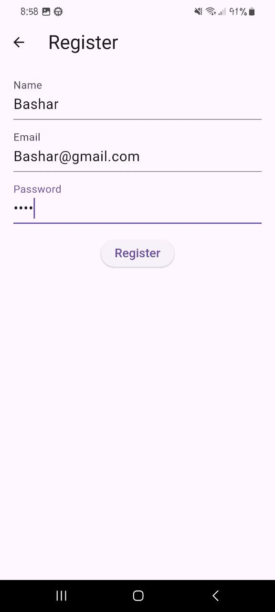
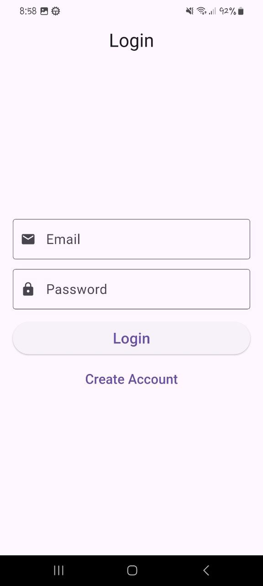
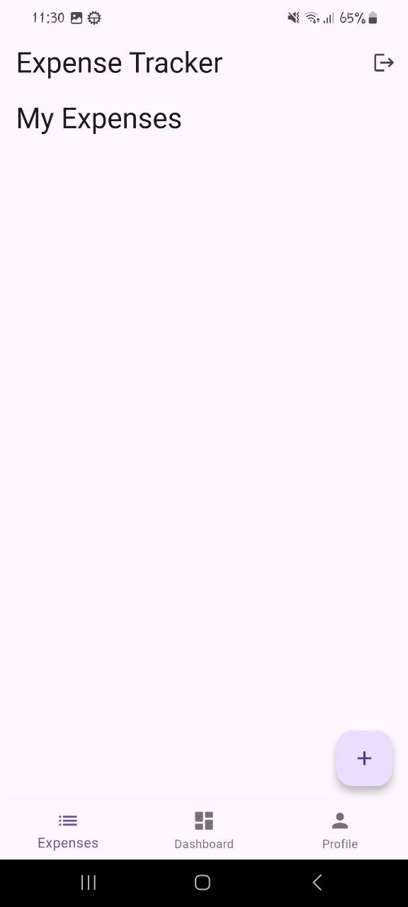
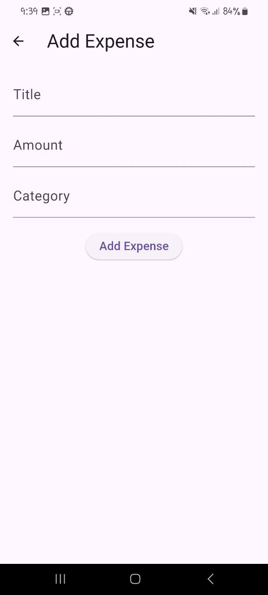
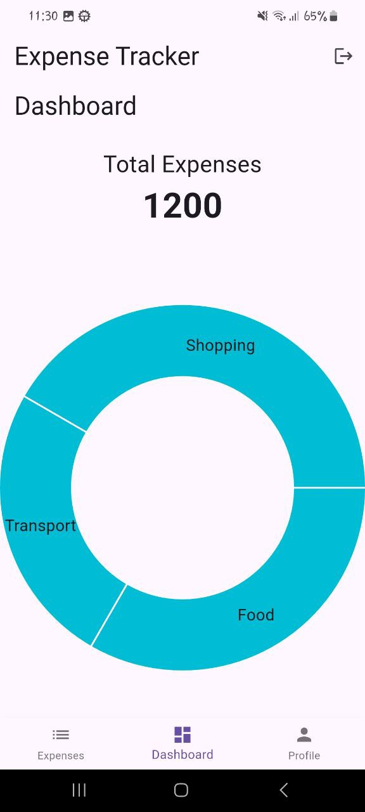

# 💰 Personal Expense Tracker

A full-stack **Personal Expense Tracker** application built with:

Backend: FastAPI  
Database: SQLite  
ORM: SQLAlchemy  
Authentication: JWT  
Frontend: Flutter

The app allows users to track their expenses, categorize spending, and view analytics through a dashboard.

---

# 🚀 Features

## Authentication
- User Registration
- User Login
- JWT Authentication
- Logout

## Expense Management
- Add expense
- View expenses
- Delete expense
- Categorize expenses

Categories:
- Food
- Transport
- Shopping
- Bills
- Entertainment

---

# 📱 Application Screenshots

## Register


## Login


## Home


## Add Expense


## Dashboard


---

# ⚙️ Run Backend

```bash
cd backend
pip install -r requirements.txt
uvicorn app.main:app --reload